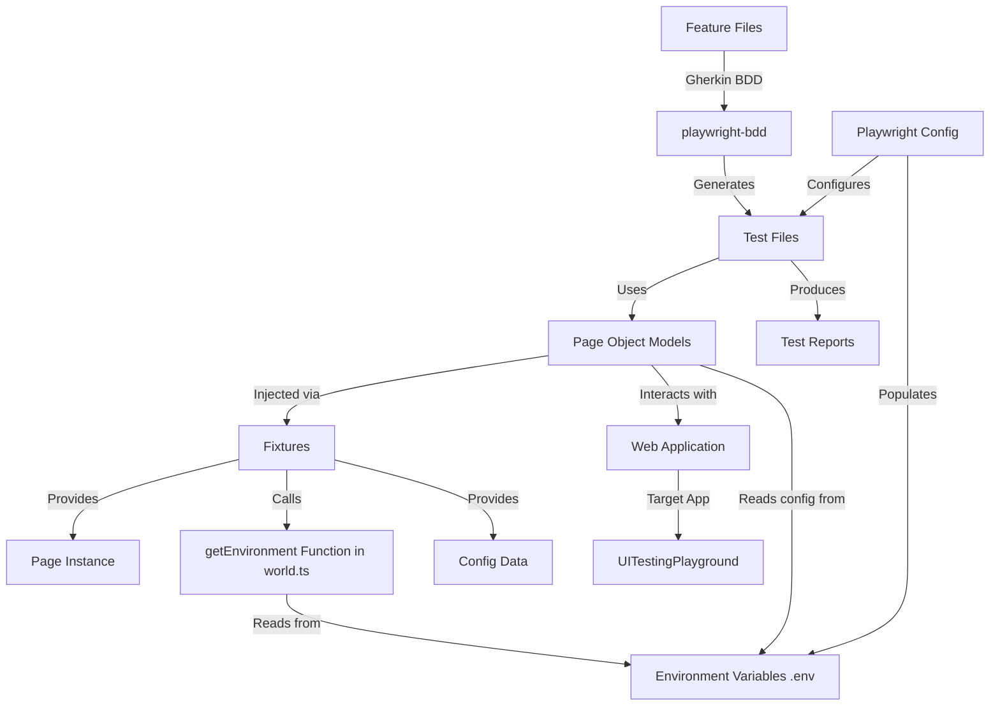
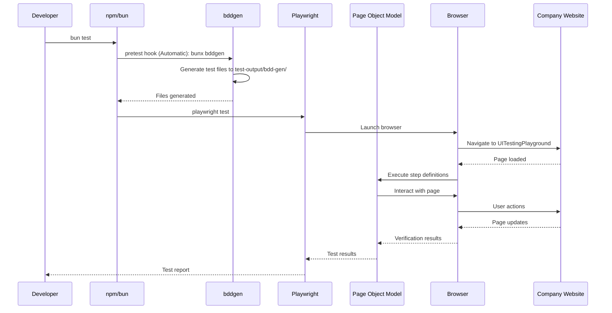
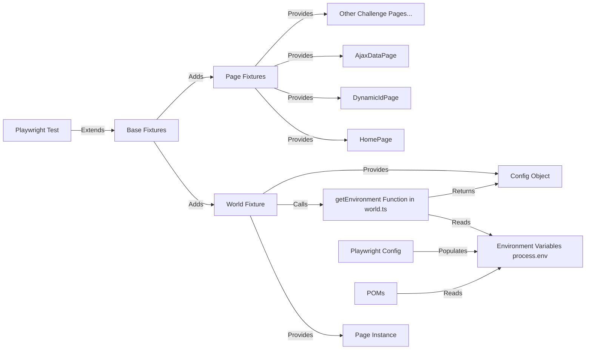
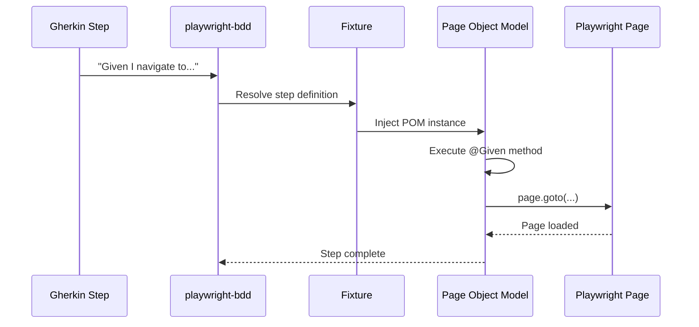
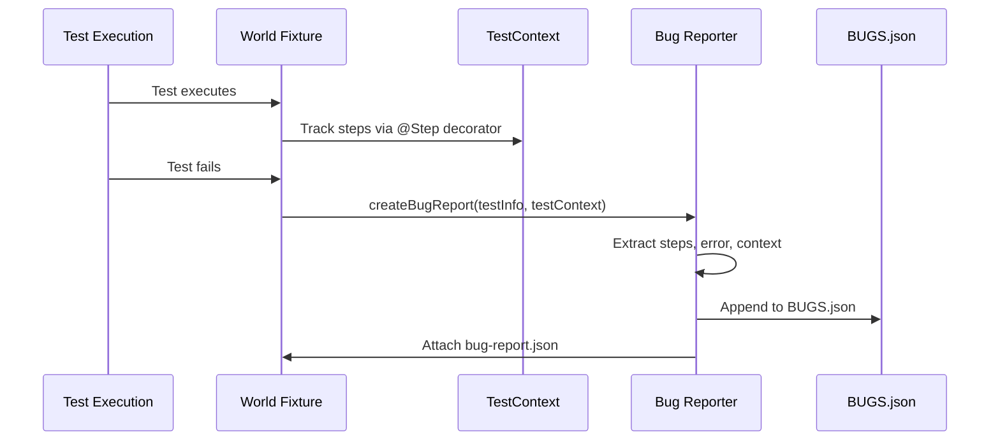

# Architecture Documentation <!-- omit from toc -->

This document describes the architecture and design decisions for the Playwright BDD Cursor Template test automation project.


## Table of Contents <!-- omit from toc -->

- [System Architecture](#system-architecture)
- [Test Execution Flow](#test-execution-flow)
- [Challenge-Based Organization](#challenge-based-organization)
  - [Challenge Structure](#challenge-structure)
  - [Challenge Isolation Pattern](#challenge-isolation-pattern)
  - [Base World Architecture](#base-world-architecture)
- [Component Architecture](#component-architecture)
  - [Page Object Models](#page-object-models-ui-challenges)
  - [Fixture System](#fixture-system)
  - [POM Registration Pattern](#pom-registration-pattern)
  - [Component Interaction](#component-interaction)
- [Code Organization](#code-organization)
  - [Path Aliases System](#path-aliases-system)
  - [Test Utilities Architecture](#test-utilities-architecture)
- [Step Definition Pattern](#step-definition-pattern)
  - [Traditional Approach vs Decorator Approach](#traditional-approach-vs-decorator-approach)
  - [Decorator Mapping](#decorator-mapping)
  - [Step Definition Flow](#step-definition-flow)
- [Bug Reporting Architecture](#bug-reporting-architecture)
- [Project Configuration](#project-configuration)
  - [Playwright Project Configuration](#playwright-project-configuration)
  - [Audit Tests Architecture](#audit-tests-architecture)
- [Deployment \& Quality Architecture](#deployment--quality-architecture)
  - [CI/CD Workflow Architecture](#cicd-workflow-architecture)

---

## System Architecture



The system follows a layered architecture where Gherkin feature files drive test generation, POMs encapsulate page interactions, and fixtures provide dependency injection. Environment configuration flows from `.env` files through Playwright config into the test runtime, ensuring consistent behavior across local and CI/CD environments.

## Test Execution Flow



The test execution follows a **fully automated flow** where a single command (`bun test`) triggers code generation, browser automation, and reporting. The `bddgen` pretest hook eliminates manual code generation steps, ensuring Gherkin feature files are always synchronized with executable test code before each test run.

## Challenge-Based Organization

Each challenge is completely isolated in its own directory under `tests/e2e/challenges/`, enabling independent test suites with separate configurations and fixtures.

### Challenge Structure

```text
tests/e2e/challenges/
├── uitestingplayground/    # UI challenge
│   ├── features/           # Gherkin feature files
│   ├── poms/               # Challenge-specific POMs
│   │   ├── pages/          # Page POMs
│   │   └── components/     # Component POMs
│   └── world.ts            # Challenge-specific fixtures (Page)
├── automationexercise/     # UI challenge
│   ├── features/
│   ├── poms/
│   ├── utils/              # Challenge-specific utilities
│   └── world.ts            # Challenge-specific fixtures (Page)
├── jsonplaceholder/        # API challenge
│   ├── features/
│   ├── services/           # API Object Models (AOM)
│   ├── utils/              # API testing utilities
│   └── world.ts            # Challenge-specific fixtures (APIRequestContext)
└── reqres/                 # API challenge
    ├── features/
    ├── services/           # API Object Models (AOM)
    ├── utils/              # API testing utilities
    └── world.ts            # Challenge-specific fixtures (APIRequestContext)
```

### Challenge Isolation Pattern

Each challenge extends the base `tests/e2e/world.ts` with challenge-specific fixtures:

```typescript
// tests/e2e/challenges/uitestingplayground/world.ts
import { test as baseTest } from '../../world';

export const test = baseTest.extend<{
  HomePage: unknown;
  DynamicIdPage: unknown;
  // ... other challenge POMs
}>({
  HomePage: async ({ page }, use) => {
    const { HomePage } = await import('./poms/pages/home-page');
    await use(new HomePage(page));
  },
  // ... other fixture registrations
});
```

This pattern ensures:

- **Complete isolation**: Challenges don't interfere with each other
- **Independent configuration**: Each challenge can have its own base URL, retries, and settings
- **Clear boundaries**: Easy to add or remove challenges without affecting others
- **Parallel execution**: Challenges can run in parallel as separate Playwright projects

### Base World Architecture

The base `tests/e2e/world.ts` provides core functionality shared by all challenges:

- Extends `playwright-bdd` test with world fixture
- Exports decorators, types, and utilities via `@world` path alias
- Handles bug reporting on test failures
- Provides environment configuration access

**World Fixture**: Provides `world` object containing:

- **`world.page`**: Playwright page instance (UI challenges only)
- **`world.request`**: APIRequestContext instance (API challenges only)
- **`world.data`**: Processed environment configuration object (via `getEnvironment()` function exported from `world.ts`)
- **`world.testContext`**: Test context object for tracking test steps and state (used for bug reporting)
- **`world.testInfo`**: Playwright TestInfo instance for test metadata and attachments

**API vs UI Challenges**:

- **UI Challenges**: Use `Page` instance from Playwright, launch browsers
- **API Challenges**: Use `APIRequestContext` instance, no browser launch
- **Shared**: Both use same world fixture pattern, bug reporting, and environment configuration

**Environment Variables**: All configuration is read from `.env` files loaded via `dotenv`:

- **Local development**: Uses `.env` (copied from `.env.example`)
- **CI/CD**: Uses `.env.production` with overrides from workflow env vars
- **Error handling**: All Playwright configs throw errors if `.env` is missing
- **No defaults**: All values must be provided in `.env` files (no hardcoded defaults in code)

Variables from `process.env` are consumed by:

- Playwright config (test configuration like `TIMEOUT`, `WORKERS`, challenge-specific `BASE_URL_<CHALLENGE>`)
- Fixtures (via `getEnvironment()` function in `world.ts` which processes `process.env` into structured config)
- POMs (for challenge-specific base URL access via `environment(\`BASE*URL*${challengeName.toUpperCase()}\`)!`exported from`@world`)

## Component Architecture

The test framework uses a layered architecture combining Page Object Models (POMs) for UI tests, API Object Models (AOMs) for API tests, Playwright fixtures, and BDD decorators for dependency injection and step definition mapping.

### Page Object Models (UI Challenges)

POMs encapsulate page interactions and define step definitions using decorators:

- **`HomePage`**: Main navigation page with links to all UITestingPlayground challenges
- **`DynamicIdPage`**, **`ClassAttributePage`**, **`VerifyTextPage`**, etc.: Individual challenge page interactions
- **`AlertHandler`**, **`SuccessLabel`**, **`BasePage`**: Reusable component POMs for common patterns

Each POM:

- Takes a `Page` instance in its constructor
- Uses decorators (`@Given`, `@When`, `@Then`) to define step implementations
- Registers itself with `@Fixture` decorator for dependency injection

### API Object Models (API Challenges)

AOMs (API Object Models) encapsulate API interactions and define step definitions using decorators:

- **`PostsService`**, **`UsersService`**, **`CommentsService`**, etc.: JSONPlaceholder API service classes
- **`AuthService`**, **`UsersService`**: ReqRes.in API service classes

Each AOM:

- Takes an `APIRequestContext` instance in its constructor
- Uses decorators (`@Given`, `@When`, `@Then`) to define step implementations
- Registers itself with `@Fixture` decorator for dependency injection
- Uses `ResponseVerifier` utilities for common response checks
- Tracks responses using `setLastResponse()` for shared step definitions

### Fixture System

Fixtures provide dependency injection, connecting POMs to test context and environment configuration:



The fixture system centralizes dependency management and ensures consistent test isolation across all test runs.

**Page Fixtures**: Instantiates and injects POM instances into step definitions via dependency injection.

Playwright fixtures provide structured dependency injection:

- Separates concerns: POM instantiation separate from step logic
- Ensures test isolation: Each test gets fresh POM instances
- Centralizes environment configuration loading
- Provides type safety via TypeScript interfaces

### POM Registration Pattern

POMs are registered as fixtures in challenge-specific `world.ts` files, enabling dependency injection into step definitions.

**Registration Flow**:

```mermaid
graph LR
    A[POM Class] -->|@Fixture decorator| B[Class Definition]
    B -->|Manually register in world.ts| C[Fixture Registration]
    C -->|Playwright-bdd resolves| D[Step Definition Injection]
    D -->|Test execution| E[POM Instance Available]
```

**Example Registration**:

```typescript
// tests/e2e/challenges/uitestingplayground/world.ts
export const test = baseTest.extend<{
  HomePage: unknown;
  DynamicIdPage: unknown;
}>({
  // Each POM is manually registered as a fixture
  HomePage: async ({ page }, use) => {
    const { HomePage } = await import('./poms/pages/home-page');
    const pom = new HomePage(page);
    await use(pom);
  },

  DynamicIdPage: async ({ page }, use) => {
    const { DynamicIdPage } = await import('./poms/pages/dynamic-id-page');
    const pom = new DynamicIdPage(page);
    await use(pom);
  },
});
```

**Key Points**:

- **Manual registration**: Each POM must be registered in the challenge's `world.ts`
- **Fresh instances**: Each test gets a new POM instance (test isolation)
- **Lazy loading**: POMs are imported only when needed (better performance)
- **Type safety**: TypeScript ensures fixture names match POM class names

**Note**: The `@Fixture` decorator on POM classes is for documentation and future tooling - actual fixture registration happens manually in `world.ts` files.

### Component Interaction

**UI Challenges**:
1. **BDD generates test files** from Gherkin feature files
2. **Generated tests** import fixtures that extend Playwright's test
3. **Step definitions** receive POM instances via fixture parameters
4. **POM methods** (decorated with `@Given`/`@When`/`@Then`) implement step logic
5. **POMs interact** with Playwright's Page API to control the browser

**API Challenges**:
1. **BDD generates test files** from Gherkin feature files
2. **Generated tests** import fixtures that extend Playwright's test
3. **Step definitions** receive AOM service instances via fixture parameters
4. **Service methods** (decorated with `@Given`/`@When`/`@Then`) implement step logic
5. **Services interact** with Playwright's `APIRequestContext` to make HTTP requests
6. **Response tracking** enables shared verification steps across services

## Code Organization

Code organization patterns and utilities that support the test framework architecture.

### Path Aliases System

TypeScript path aliases provide clean, maintainable imports throughout the codebase:

```typescript
// tsconfig.json paths configuration
{
  "@world": ["./tests/e2e/world.ts"],
  "@components/*": ["./tests/e2e/challenges/uitestingplayground/poms/components/*"],
  "@pages/*": ["./tests/e2e/challenges/uitestingplayground/poms/pages/*"],
  "@automationexercise/*": ["./tests/e2e/challenges/automationexercise/*"],
  "@utils": ["./tests/utils/index.ts"],
  "@scripts/*": ["./scripts/*"]
}
```

**Usage Examples**:

```typescript
// Import from base world (core exports)
import { Fixture, Given, Step, expect, environment, type Page } from '@world';

// Import challenge-specific POMs
import { AlertHandler } from '@components/alert-handler';
import { HomePage } from '@pages/home-page';

// Import utilities
import { getRandomIndex, getEnvironment } from '@utils';

// Import challenge-specific utilities
import { createTestUser } from '@automationexercise/utils/user-data';
```

**Benefits**:

- **No relative path navigation**: Eliminates `../../../../` imports
- **Clear intent**: Path aliases indicate where code comes from
- **Refactoring safety**: Moving files doesn't break imports
- **Better IDE support**: Improved autocomplete and navigation

### Test Utilities Architecture

The `tests/utils/` directory provides reusable utilities shared across all challenges and tests.

**Utility Modules**:

- **`decorators.ts`**: Custom `@Step` decorator implementation
- **`environment.ts`**: Environment variable access and configuration processing
- **`bug-reporter.ts`**: Bug report creation and file management
- **`attachments.ts`**: File attachment utilities for test reports
- **`locators.ts`**: Locator helper functions
- **`network.ts`**: Network request utilities
- **`pagination.ts`**: Pagination helpers
- **`random.ts`**: Random data generation utilities
- **`format.ts`**: Formatting utilities
- **`browser-project.ts`**: Browser project configuration helpers

**Utility Access Pattern**:

All utilities are exported from `tests/utils/index.ts` and accessible via `@utils`:

```typescript
import {
  getEnvironment,
  environment,
  Step,
  attachFileFromStep,
  getRandomIndex,
  // ... other utilities
} from '@utils';
```

**Key Utilities**:

- **Environment**: `getEnvironment()` processes all env vars into typed config
- **Bug Reporting**: Automatic tracking and reporting of test failures
- **Step Tracking**: `@Step` decorator tracks steps for bug reports
- **Attachments**: File attachment helpers for test reports
- **Random Data**: Utilities for generating test data

POMs are registered as fixtures in challenge-specific `world.ts` files, enabling dependency injection into step definitions.

**Registration Flow**:

```mermaid
graph LR
    A[POM Class] -->|@Fixture decorator| B[Class Definition]
    B -->|Manually register in world.ts| C[Fixture Registration]
    C -->|Playwright-bdd resolves| D[Step Definition Injection]
    D -->|Test execution| E[POM Instance Available]
```

**Example Registration**:

```typescript
// tests/e2e/challenges/uitestingplayground/world.ts
export const test = baseTest.extend<{
  HomePage: unknown;
  DynamicIdPage: unknown;
}>({
  // Each POM is manually registered as a fixture
  HomePage: async ({ page }, use) => {
    const { HomePage } = await import('./poms/pages/home-page');
    const pom = new HomePage(page);
    await use(pom);
  },

  DynamicIdPage: async ({ page }, use) => {
    const { DynamicIdPage } = await import('./poms/pages/dynamic-id-page');
    const pom = new DynamicIdPage(page);
    await use(pom);
  },
});
```

**Key Points**:

- **Manual registration**: Each POM must be registered in the challenge's `world.ts`
- **Fresh instances**: Each test gets a new POM instance (test isolation)
- **Lazy loading**: POMs are imported only when needed (better performance)
- **Type safety**: TypeScript ensures fixture names match POM class names

**Note**: The `@Fixture` decorator on POM classes is for documentation and future tooling - actual fixture registration happens manually in `world.ts` files.

## Step Definition Pattern

Step definitions use playwright-bdd decorators to map Gherkin steps directly to POM methods, eliminating the need for separate step definition files (`steps.ts`).

### Traditional Approach vs Decorator Approach

**Traditional BDD approach ❌** (indirection) requires separate step definition files:

```typescript
// steps.ts (traditional approach)
import { Given, When, Then } from '@cucumber/cucumber';
import { ConfiguratorPage } from '../poms/pages/configurator-page';

Given('I navigate to the configurator page', async function () {
  const page = new ConfiguratorPage(this.page);
  await page.navigate();
});
```

This creates **indirection**: Gherkin → step definition file → POM method, requiring manual wiring and maintaining synchronization between step text and implementation.

**Decorator approach ✅** (direct co-location) maps steps directly in POM classes:

```typescript
import { Fixture, Given, When, Then, Step, expect, environment, type Page } from '@world';

@Fixture('HomePage')
export class HomePage {
  private pageTitleLocator: Locator;

  constructor(protected page: Page) {
    this.pageTitleLocator = this.page.getByRole('heading', { level: 1 });
  }

  @Given('I navigate to the UITestingPlayground home page')
  async navigate(): Promise<void> {
    const baseUrl = environment('BASE_URL_UITESTINGPLAYGROUND')!;
    await this.page.goto(baseUrl);
    await this.iSeeTheHomePage();
  }

  @Step
  private async iSeeTheHomePage(): Promise<void> {
    // Internal step that appears in test reports
    await expect(this.pageTitleLocator).toBeVisible();
  }
}
```

**Key decorators:**

- **`@Step`**: **Custom innovation** - decorator we created for internal helper methods that should appear in Playwright test reports with structured visibility (defined in `tests/utils/decorators.ts`)
- **`@Fixture`**: Registers the POM class for dependency injection
- **`@Given`, `@When`, `@Then`**: Map Gherkin steps to methods (from playwright-bdd)

This **eliminates** the intermediate step definition layer, co-locating step text with implementation and reducing boilerplate. The custom `@Step` decorator enables granular test reporting for internal helper methods without exposing them as Gherkin steps.

### Decorator Mapping

- **`@Given`**: Setup steps (e.g., "Given I navigate to...")
- **`@When`**: Action steps (e.g., "When I click...")
- **`@Then`**: Assertion steps (e.g., "Then I should see...")

### Step Definition Flow



Decorators bridge the gap between Gherkin's human-readable syntax and executable code, providing compile-time validation and eliminating runtime step resolution overhead.

## Bug Reporting Architecture

Automatic bug reporting captures test failures with context for debugging and issue tracking.

**Bug Report Generation Flow**:



**Test Context Tracking**:

The `@Step` decorator automatically tracks executed steps:

```typescript
// @Step decorator tracks steps automatically
@Step
private async iSeeTheHomePage(): Promise<void> {
  // This step is tracked in testContext
  await expect(this.pageTitleLocator).toBeVisible();
}
```

**Bug Report Structure**:

```typescript
interface BugReport {
  timestamp: string;
  cableBeginningType: string; // Test-specific context
  cableBeginningConnector: string;
  cableEndType: string;
  cableEndConnector: string;
  error: string; // Error message
  stepsToReproduce: string[]; // Tracked steps
}
```

**Automatic Bug Report Creation**:

Bug reports are created automatically in the world fixture cleanup:

```typescript
// tests/e2e/world.ts
world: async ({ page, testInfo }, use) => {
  const testContext = getTestContext(testInfo.testId);
  const world = { page, data, testContext, testInfo };

  await use(world);

  // Cleanup: Create bug report on failure
  if (testInfo.error) {
    const bugReport = createBugReport(testInfo, testContext);
    await appendBugReport(bugReport); // Write to BUGS.json
    await attachFileFromStep('bug-report.json', JSON.stringify(bugReport));
  }
};
```

**Bug Report Output**:

- **BUGS.json**: JSON file containing all bug reports (root directory)
- **Test attachments**: bug-report.json attached to failed tests
- **Steps tracking**: All `@Step` decorated methods are tracked automatically

## Project Configuration

Configuration and setup for test execution, including Playwright projects and audit tests.

### Playwright Project Configuration

Challenges are configured as separate Playwright projects, enabling independent execution and configuration.

**Project Structure**:

```typescript
// playwright.config.ts
projects: [
  // Each challenge × browser combination = separate project
  ...challenges.flatMap((challenge) => {
    const challengeBaseUrl = environment(`BASE_URL_${challenge.toUpperCase()}`)!;
    const projectRetries = challenge === 'automationexercise' ? baseRetries + 1 : baseRetries;

    if (apiChallenges.includes(challenge)) {
      // API challenges: No browser, only baseURL
      return [{ name: `${challenge}-api`, ... }];
    }

    return [
      // Chromium project
      { name: `${challenge}-chromium`, ... },
      // Firefox project
      { name: `${challenge}-firefox`, ... },
      // WebKit project
      { name: `${challenge}-webkit`, ... },
    ];
  }),
  // Audit test projects
  { name: 'lighthouse', ... },
  { name: 'axe', ... },
]
```

**Challenge Project Configuration**:

Each challenge project:

- Has its own `testDir` via `defineBddConfig()` pointing to challenge's `world.ts`
- Uses challenge-specific `BASE_URL_<CHALLENGE>` environment variable
- Can have custom retry counts (e.g., AutomationExercise gets extra retry for flakiness)
- Generates test files to `test-output/bdd-gen/<challenge>/`

**API Challenge Configuration**:

API challenges (e.g., `jsonplaceholder-api`, `reqres-api`):

- **No browser launch**: Only `baseURL` in `use` config, no browser configuration
- **APIRequestContext**: Uses Playwright's `APIRequestContext` instead of `Page`
- **Faster execution**: No browser overhead, pure HTTP requests
- **Same BDD pattern**: Uses same Gherkin/feature file approach as UI challenges

**Project Benefits**:

- **Selective execution**: Run specific challenges with `--project=uitestingplayground-chromium` or `--project=jsonplaceholder-api`
- **Independent configuration**: Each challenge can have different settings
- **Parallel execution**: Projects run in parallel by default
- **Clear separation**: Challenges don't interfere with each other
- **Optimized execution**: API challenges run faster without browser launch

### Audit Tests Architecture

Accessibility and performance audit tests run as separate projects outside the BDD framework.

**Audit Test Projects**:

- **`axe` project**: Runs `tests/audit/axe.spec.ts` for accessibility audits
- **`lighthouse` project**: Runs `tests/audit/lighthouse.spec.ts` for performance audits

**Key Differences from BDD Tests**:

- **No BDD**: Direct Playwright tests (no Gherkin/feature files)
- **Separate execution**: Run independently via `bun axe` or `bun lighthouse`
- **No retries**: Audit tests run once (retries: 0)
- **Different reporting**: Focused on audit metrics, not step-by-step execution

**Audit Test Structure**:

```typescript
// tests/audit/axe.spec.ts
import { test, expect } from '@playwright/test';
import { injectAxe, checkA11y } from 'axe-playwright';

test.describe('Axe Accessibility Audits', () => {
  test('should have no accessibility violations', async ({ page }) => {
    await page.goto(targetUrl);
    await injectAxe(page);
    await checkA11y(page);
  });
});
```

**Note**: Audit tests are part of the unified `playwright.config.ts` but use a different architectural pattern than BDD tests, running as separate projects with their own configuration.

## Deployment & Quality Architecture

This section covers the CI/CD workflows, quality gates, and local development tools for ensuring production-ready test automation.

### CI/CD Workflow Architecture

The project uses modular GitHub Actions workflows for CI/CD orchestration, test execution, and automated report publishing. For detailed workflow structure, local testing instructions, and configuration details, see the [CI/CD Workflow Structure section in Development Guide](./development.md#cicd-workflow-structure).
