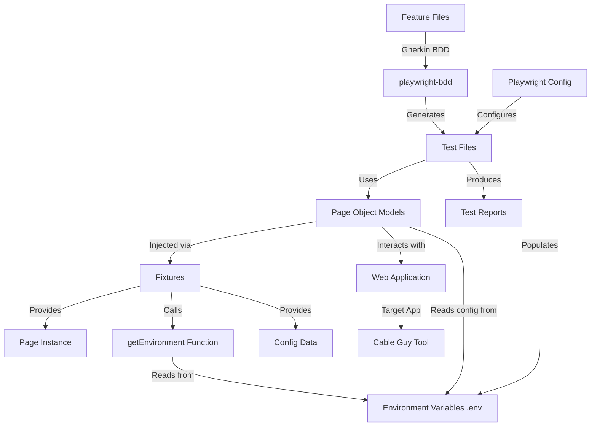
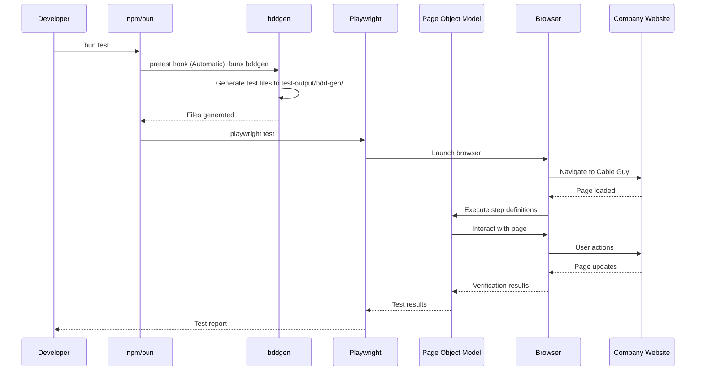
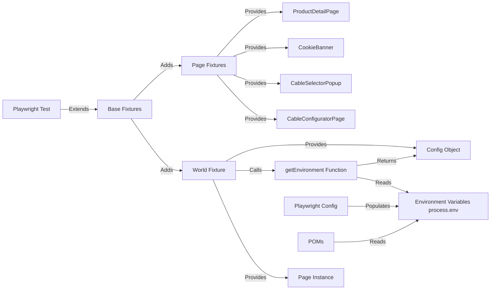

# Architecture Documentation <!-- omit from toc -->

This document describes the architecture and design decisions for the technical challenge test automation project.


## Table of Contents <!-- omit from toc -->

- [System Architecture](#system-architecture)
- [Test Execution Flow](#test-execution-flow)
- [Component Architecture](#component-architecture)
  - [Page Object Models](#page-object-models)
  - [Fixture System](#fixture-system)
  - [Component Interaction](#component-interaction)
- [Step Definition Pattern](#step-definition-pattern)
  - [Traditional Approach vs Decorator Approach](#traditional-approach-vs-decorator-approach)
  - [Decorator Mapping](#decorator-mapping)
  - [Step Definition Flow](#step-definition-flow)
- [Deployment \& Quality Architecture](#deployment--quality-architecture)
  - [CI/CD Workflow Architecture](#cicd-workflow-architecture)
  - [Local Workflow Testing](#local-workflow-testing)

---

## System Architecture



The system follows a layered architecture where Gherkin feature files drive test generation, POMs encapsulate page interactions, and fixtures provide dependency injection. Environment configuration flows from `.env` files through Playwright config into the test runtime, ensuring consistent behavior across local and CI/CD environments.

## Test Execution Flow



The test execution follows a **fully automated flow** where a single command (`bun test`) triggers code generation, browser automation, and reporting. The `bddgen` pretest hook eliminates manual code generation steps, ensuring Gherkin feature files are always synchronized with executable test code before each test run.

## Component Architecture

The test framework uses a layered architecture combining Page Object Models (POMs), Playwright fixtures, and BDD decorators for dependency injection and step definition mapping.

### Page Object Models

POMs encapsulate page interactions and define step definitions using decorators:

- **`CableConfiguratorPage`**: Main application interactions with cable selection, manufacturer filtering, and basket functionality
- **`CableSelectorPopup`**: Cable selector popup dialog interactions
- **`CookieBanner`**: Cookie banner dialog handling
- **`ProductDetailPage`**: Product detail page interactions

Each POM:

- Takes a `Page` instance in its constructor
- Uses decorators (`@Given`, `@When`, `@Then`) to define step implementations
- Registers itself with `@Fixture` decorator for dependency injection

### Fixture System

Fixtures provide dependency injection, connecting POMs to test context and environment configuration:



The fixture system centralizes dependency management and ensures consistent test isolation across all test runs.

**World Fixture**: Provides `world` object containing:

- **`world.page`**: Playwright page instance
- **`world.data`**: Processed environment configuration object (via `getEnvironment()` function)
- **`world.testContext`**: Test context object for tracking test steps and state (used for bug reporting)
- **`world.testInfo`**: Playwright TestInfo instance for test metadata and attachments

The fixture calls `getEnvironment()` which reads from `process.env` and returns a structured configuration object.

**Environment Variables**: All configuration is read from `.env` files loaded via `dotenv`:

- **Local development**: Uses `.env` (copied from `.env.example`)
- **CI/CD**: Uses `.env.production` with overrides from workflow env vars
- **Error handling**: All Playwright configs throw errors if `.env` is missing
- **No defaults**: All values must be provided in `.env` files (no hardcoded defaults in code)

Variables from `process.env` are consumed by:

- Playwright config (test configuration like `TIMEOUT`, `WORKERS`, `BASE_URL`)
- Fixtures (via `getEnvironment()` function which processes `process.env` into structured config)
- POMs (for direct `BASE_URL` access)

**Note**: Audit test suites (`axe.spec.ts`, `lighthouse.spec.ts`) run as separate projects in the unified `playwright.config.ts`, but are not part of the core BDD test architecture.

**Page Fixtures**: Instantiates and injects POM instances into step definitions via dependency injection.

Playwright fixtures provide structured dependency injection:

- Separates concerns: POM instantiation separate from step logic
- Ensures test isolation: Each test gets fresh POM instances
- Centralizes environment configuration loading
- Provides type safety via TypeScript interfaces

### Component Interaction

1. **BDD generates test files** from Gherkin feature files
2. **Generated tests** import fixtures that extend Playwright's test
3. **Step definitions** receive POM instances via fixture parameters
4. **POM methods** (decorated with `@Given`/`@When`/`@Then`) implement step logic
5. **POMs interact** with Playwright's Page API to control the browser

## Step Definition Pattern

Step definitions use playwright-bdd decorators to map Gherkin steps directly to POM methods, eliminating the need for separate step definition files (`steps.ts`).

### Traditional Approach vs Decorator Approach

**Traditional BDD approach ❌** (indirection) requires separate step definition files:

```typescript
// steps.ts (traditional approach)
import { Given, When, Then } from '@cucumber/cucumber';
import { ConfiguratorPage } from '../poms/pages/configurator-page';

Given('I navigate to the configurator page', async function () {
  const page = new ConfiguratorPage(this.page);
  await page.navigate();
});
```

This creates **indirection**: Gherkin → step definition file → POM method, requiring manual wiring and maintaining synchronization between step text and implementation.

**Decorator approach ✅** (direct co-location) maps steps directly in POM classes:

```typescript
import { Fixture, Given, When, Then, Step } from '@world';

@Fixture('CableConfiguratorPage')
export class CableConfiguratorPage {
  constructor(protected page: Page) {}

  @When('I click the cable beginning button')
  async clickCableBeginning(): Promise<void> {
    await this.iVerifyCableConfiguratorReady();
    await this.page.getByRole('button', { name: 'cable beginning' }).click();
  }

  @Step
  private async iVerifyCableConfiguratorReady(): Promise<void> {
    // Internal step that appears in test reports
    await expect(this.page.locator('.cg-configurator')).toBeVisible();
  }
}
```

**Key decorators:**

- **`@Step`**: **Custom innovation** - decorator we created for internal helper methods that should appear in Playwright test reports with structured visibility (defined in `tests/utils/decorators.ts`)
- **`@Fixture`**: Registers the POM class for dependency injection
- **`@Given`, `@When`, `@Then`**: Map Gherkin steps to methods (from playwright-bdd)

This **eliminates** the intermediate step definition layer, co-locating step text with implementation and reducing boilerplate. The custom `@Step` decorator enables granular test reporting for internal helper methods without exposing them as Gherkin steps.

### Decorator Mapping

- **`@Given`**: Setup steps (e.g., "Given I navigate to...")
- **`@When`**: Action steps (e.g., "When I click...")
- **`@Then`**: Assertion steps (e.g., "Then I should see...")

### Step Definition Flow


Decorators bridge the gap between Gherkin's human-readable syntax and executable code, providing compile-time validation and eliminating runtime step resolution overhead.

## Deployment & Quality Architecture

This section covers the CI/CD workflows, quality gates, and local development tools for ensuring production-ready test automation.

### CI/CD Workflow Architecture

The project uses modular GitHub Actions workflows for CI/CD:

- **`ci.yml`**: Main orchestrator workflow that coordinates test, lighthouse, and axe workflows
- **`unit-tests.yml`**: Unit tests workflow (runs before other workflows)
- **`test.yml`**: E2E tests workflow with sharding for parallel execution
- **`lighthouse.yml`**: Lighthouse performance audit workflow
- **`axe.yml`**: Axe accessibility audit workflow
- **`publish.yml`**: Report publishing workflow for GitHub Pages
- **`dependabot.yml`**: Dependabot configuration for automated dependency updates (GitHub feature, not a workflow file)

Dependabot configuration is in `.github/dependabot.yml` (separate from workflow files). Dependabot is a GitHub feature that automatically creates pull requests for dependency updates. The configuration file specifies which package ecosystems to monitor and how to handle updates.

Workflows can run independently or be orchestrated together via the main CI workflow. Each workflow supports both `push/pull_request` triggers and `workflow_call` for reusability.

### Local Workflow Testing

GitHub Actions workflows can be tested locally using [act](https://github.com/nektos/act) via Makefile targets:

- `make test` - Test E2E tests workflow locally (verbose output)
- `make lighthouse` - Test Lighthouse audit workflow locally
- `make axe` - Test Axe audit workflow locally
- `make publish` - Test publish reports workflow locally
- `make ci` - Test main CI workflow locally
- `make test-dryrun` - Dry run for workflow validation

See [Act Testing Documentation](./act-testing.md) for detailed setup and usage.
